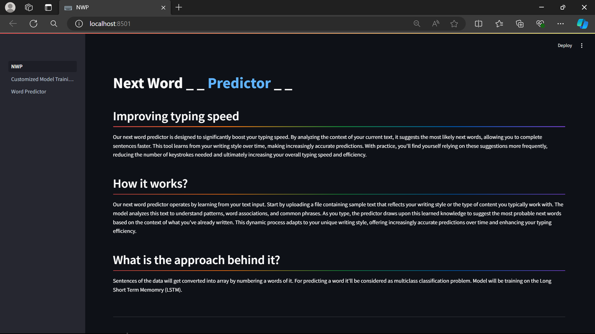
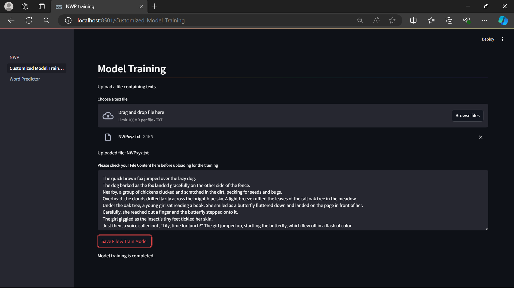
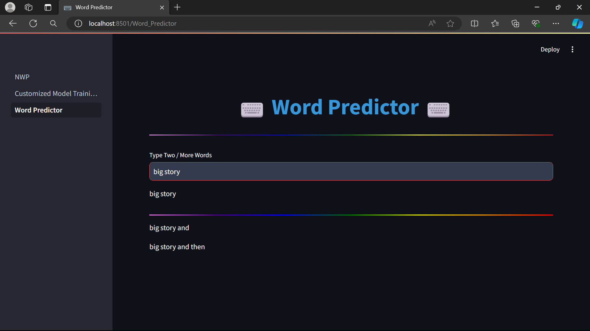

## Next Word Predictor

Our next word predictor operates by learning from your text input. Start by uploading a file containing sample text that reflects your writing style or the type of content you typically work with. 

The model analyzes this text to understand patterns, word associations, and common phrases. As you type, the predictor draws upon this learned knowledge to suggest the most probable next words based on the context of what you've already written. 

This dynamic process adapts to your unique writing style, offering increasingly accurate predictions over time and enhancing your typing efficiency.

<details open="open">
  <summary>Table of Contents</summary>
  <ol>
    <li>
      <a href="#Approach">Approach</a>
    </li>
    <li>
      <a href="#Features">Features</a>
    </li>
    <li>
      <a href="#Technologies">Technologies</a>
    </li>
    <li>
      <a href="#Prototype">Protoype</a>
    </li>
    <li>
	    <a href = "#How-to-Start-Project">How to Start Project</a>
    </li>
    <li>
	    <a href = "#Contact-Us">Contact Us</a>
    </li>
    <li>
	    <a href = "#License">License</a>
    </li>
  </ol>
</details>

## Approach
- Sentences of the data will get converted into array by numbering a words of it. 
- For predicting a word it'll be considered as multiclass classification problem. 
- Model will be training on the Long Short Term Memomry (LSTM).


## Features
Our next word predictor is designed to significantly boost your typing speed. 
- By analyzing the context of your current text, it suggests the most likely next words, allowing you to complete sentences faster. 
- This tool learns from your writing style over time, making increasingly accurate predictions. With practice, you'll find yourself relying on these suggestions more frequently, reducing the number of keystrokes needed and ultimately increasing your overall typing speed and efficiency.

## Technologies
- Python
- Streamlit
- Tensorflow
- LSTM

## Prototype:

<div style="display:flex; flex-wrap:wrap; gap:2%; justify-content:center;">



</div>

## How to Start Project

Follow these steps to get started with the project:

1. **Clone the Repository:**
   ```bash
   git clone <repository_link>
   ```
2. **Install Anaconda:**
   
   Make sure you have Anaconda installed on your system. If not, you can download and install it from the official website: https://www.anaconda.com/download/
   
4. **Create a Virtual Environment:**
   
   Create a new virtual environment using Python 3.8:

   ```bash
   conda create --name your_env_name python=3.8 -y
   ```
   Replace your_env_name with the desired name for your virtual environment.
   
   Activate the newly created environment:
   ```bash
   conda activate your_env_name
   ```
5. **Install Dependencies:**
   
   Install the project dependencies by running:
   ```bash
   pip install -r requirements.txt
   ```
   This command will install all the required packages listed in the requirements.txt file.

7. **Run the Streamlit App:**
   ```bash
   streamlit run Home.py
   ```
   This command will start the Streamlit app.

## Contact Us

To learn more about, please reach out:

📧 suzalkachhadiya111@gmail.com

## License

This project is licensed under the MIT License - see the [LICENSE](LICENSE) file for details.